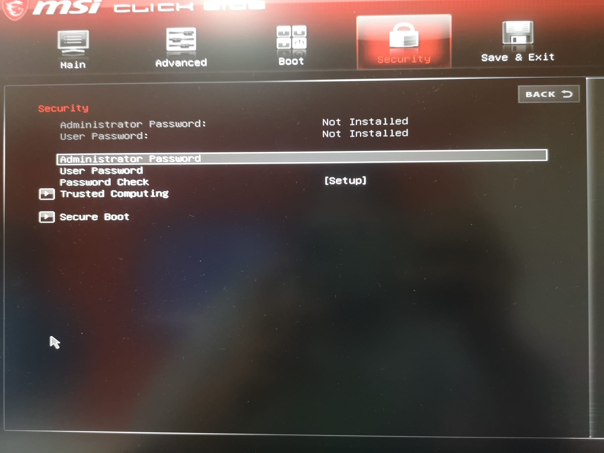
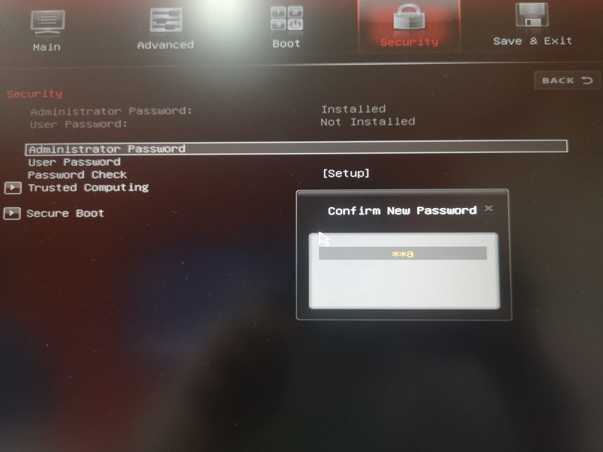
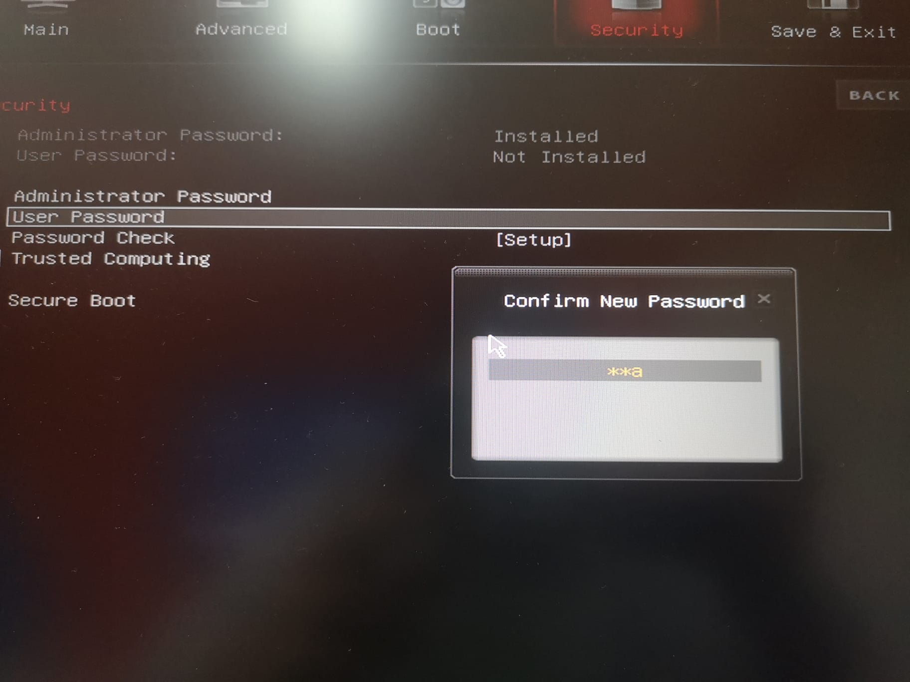
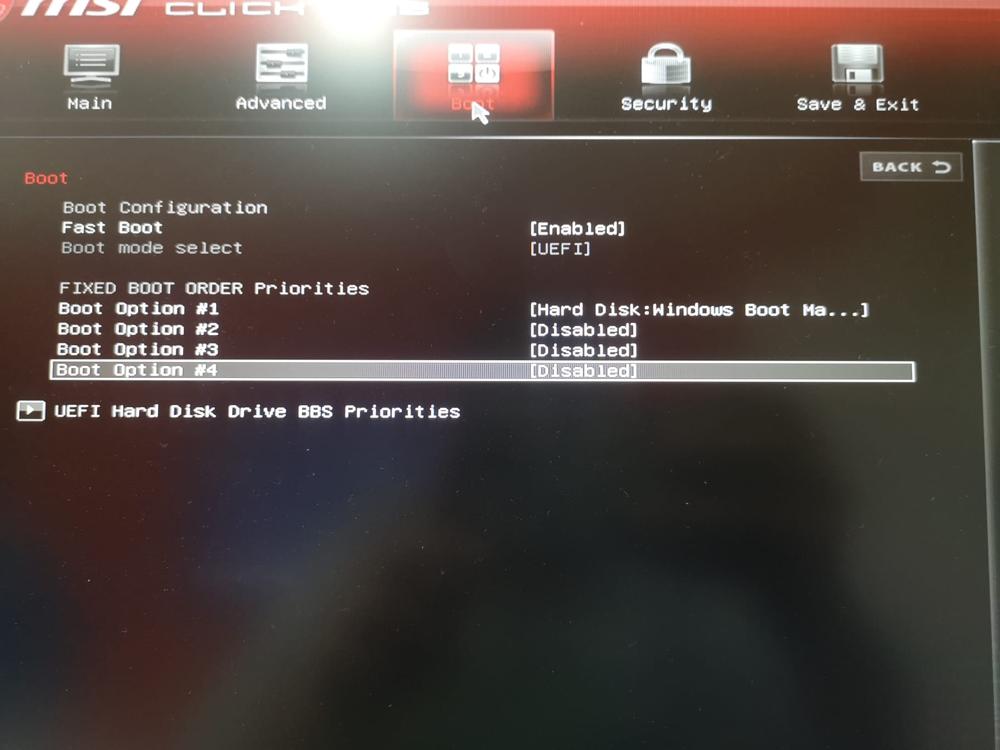

author: Abel Posado Reyes
summary: Asegurar la BIOS correctamente
id: equipo-real-bios
categories: codelab,markdown
environments: Web
status: Published
feedback link: Un enlace en el que los usuarios puedan darte feedback (quizás creando un issue en un repositorio de git)
analytics account: ID de Google Analytics

# Equipo físico.
##Paso 1
Duration: 0:02:00

Debemos encender la computadora y presionar la tecla Suprimir, una vez hayamos realizado ese paso, la propia computadora arrancará la #BIOS de forma automatica. Una vez dentro de ella debemos buscar la pestaña Security.

##Paso 2
Duration: 0:02:00

Lo siguiente que haremos sera cambiar la contraseña de administrador.

A continuación cambiaremos la del usuario.

##Paso 3
Duration: 0:02:00

Como último paso debemos realizar es ordenar el arranque del equipo, para ello debemos asistir a la pestaña Boot, y aquí vamos a realizar un paso fundamental para la seguridad de nuestra computadora. En el primer lugar, vamos a desactivar el arranque desde cualquier dispositivo externo, para ello vamos a poner en la opción 1 el disco duro donde esta instalador nuestro sistema operativo y las demás opciones las desactivamos.

